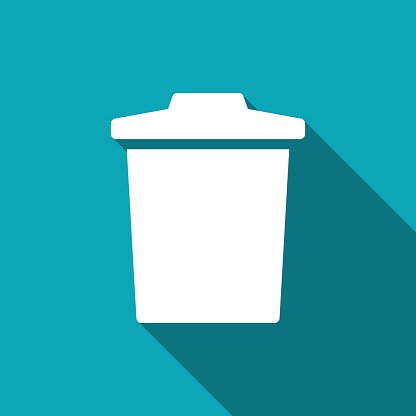

# Php-ile-toplu-resim-upload-etme
PHP bilenler için çok kolay ama benim gibi bilmeyenler için çok zor olan bir konuya değineceğim. PHP yardımı ile class.upload kütüphanesini kullanarak toplu olarak fotoğrafları upload edeceğiz. Upload ettiğimiz fotoğrafları istediğimiz ebatta küçültüp artı olarak thumbnial oluşturup, fotoğrafımıza watermark ekleyeceğiz, sunucuya yüklediğimiz fotoğrafları PDO kullanarak veri tabanına kaydedip istediğimiz fotoğrafları da sileceğiz.
Kodlama Kısmı
İlk önce class.upload kütüphanesini indirip projemize dahil edeceğiz.

Functions.php
Bu dosya ile db bağlantımızı oluşturuyoruz.

1
2
3
4
5
6
7
8
9
10
11
12
<?php
set_time_limit(0);
error_reporting(0);
ini_set("display_errors",0);
try {
$db = new PDO("mysql:host=localhost;dbname=dbadi", "kullaniciadi", "sifre",array(PDO::MYSQL_ATTR_INIT_COMMAND =>"SET NAMES utf8",PDO::MYSQL_ATTR_INIT_COMMAND => "SET CHARACTER SET utf8",array( PDO::ATTR_ERRMODE => PDO::ERRMODE_EXCEPTION )));
} catch ( PDOException $e ){
print $e->getMessage();
}
$limit = 10;
$sitedomain = "zulfumehmet.tk";
?>
Yukarıdaki dosya sayesinde her sayfada db bağlantısı gerçekleştirmeye gerek kalmadan db bağlantımızı oluşturuyoruz.

index.php?id=xxx
Bu sayfada fotoğraf yükleme ve görüntüleme işlemlerini gerçekleştireceğiz. Kodlarımız şu şekilde

1
2
3
4
5
6
7
8
9
10
11
12
13
14
15
16
17
18
19
20
21
22
23
24
25
26
27
28
29
30
31
32
33
34
35
36
37
38
39
40
41
42
43
44
45
46
47
48
49
50
51
52
53
54
55
56
57
58
59
60
61
62
63
64
65
66
67
68
69
70
71
72
73
74
75
76
77
78
79
80
81
82
83
84
85
86
87
88
89
90
91
92
93
94
95
96
97
98
99
100
101
102
103
104
105
106
107
108
109
110
111
112
113
114
115
116
117
118
119
120
121
122
123
124
125
126
127
128
<?
 
$parametreler = strtolower($_SERVER['QUERY_STRING']); //Adres satırından gelen tüm sorguları aldık.
$yasaklar="%¿¿'¿¿`¿¿insert¿¿concat¿¿delete¿¿join¿¿update¿¿select¿¿\"¿¿\\¿¿<¿¿>¿¿tablo_adim¿¿kolon_adim"; //Buraya tablo adlarınızı da ekleyiniz. Her ekleme sonrasını ¿¿ ile ayırmalısınız.
$yasakla=explode('¿¿',$yasaklar);
$sayiver=substr_count($yasaklar,'¿¿');
$i=0;
while ($i<=$sayiver) {
if (strstr($parametreler,$yasakla[$i])) {
header("location:http://www.zulfumehmet.com/"); //Sql injection girişimi yakalandığında yönlendiriyoruz.
exit;
}
 
$i++;
}
 
if (strlen($parametreler)>=90) {
header("location:http://www.zulfumehmet.com/");
exit;
}
// yukardaki komutlar sql injection onlemek maksatli
include 'functions.php'; // db baglantisini yapalim
?>
 
<?php $gelen_kod = $_GET["id"]; //atadigimiz id numarasini cagiralim index.php?id=xx hangi numara verdigimizi bilelim?>
 
<!DOCTYPE html>
<html>
<head>
<meta http-equiv="Content-Type" content="text/html; charset=utf-8" />
<title>Resimler </title>
<link rel="stylesheet" href="assets/css/styles.css" />

<link href="https://fonts.googleapis.com/css?family=Roboto:300,400,500" rel="stylesheet">

 

</head>
<body>
 
 

 
 

 

 
 

Lütfen resim seçip Yükle butonuna tıklayınız. Resim Yükleme işleminin bitmesini bekleyiniz.

<form action="aupload.php" method="post" enctype="multipart/form-data">
<input type="hidden" name="adi" value="<?php echo $gelen_kod; ?>">
<input type="file" name="image[]" accept="image/png, image/jpeg" multiple />

<input type="submit" name="submit" value="Yükle" onclick="Goster()" />

<!--Yukarilar susleme sanati ile alakali -->

<?php
$query= $db -> prepare("SELECT * FROM resimler where ilanID='$gelen_kod'"); // resimler tablaosunda bulunan atadigimiz id ait bilgi varsa resimleri gostersin.
$query-> execute();
$musteriler = $query -> fetchAll(); ?>
 
<?php
foreach($musteriler as $dizi){
?>
 
<a href="sil.php?id=<?=$dizi["Id"]?>" class="album">
/thumbnail/<?=$dizi["kucuk"]?>" alt="<?=$dizi["kucuk"]?>" />

Sil
</a>
 
 
<?php }
// dongu olusturup resimlerin hepsini siralamasini istedik. Arti olarak silmek icinde resmin idsini kullanacagiz
?>

 
</body>
</html>
Sil.Php
Bu dosya yardımı ilede db kayıtlı olan ilanları hem sunucudan hem db den sileceğiz. Kodlarımız şu şekilde.

1
2
3
4
5
6
7
8
9
10
11
12
13
14
15
16
17
18
19
20
21
22
23
24
25
26
27
28
29
30
31
32
33
34
35
36
37
38
39
40
41
42
43
44
45
46
47
48
49
50
51
52
53
54
55
56
57
58
59
60
61
62
63
64
65
66
67
68
69
70
71
72
73
74
75
76
77
78
79
80
81
82
83
84
85
86
87
88
89
90
91
92
93
94
95
96
97
98
99
100
101
102
<html>
<head>
<meta http-equiv="Content-Type" content="text/html; charset=utf-8" />
<title>Resimler </title>
<link rel="stylesheet" href="assets/css/styles.css" />

<link href="https://fonts.googleapis.com/css?family=Roboto:300,400,500" rel="stylesheet">

<meta name="viewport" content="width=device-width, initial-scale=1">
<link rel="stylesheet" href="w3.css">
 
</head>
<body>
 
<?php
 
$parametreler = strtolower($_SERVER['QUERY_STRING']); //Adres satırından gelen tüm sorguları aldık.
$yasaklar="%¿¿'¿¿`¿¿insert¿¿concat¿¿delete¿¿join¿¿update¿¿select¿¿\"¿¿\\¿¿<¿¿>¿¿tablo_adim¿¿kolon_adim"; //Buraya tablo adlarınızı da ekleyiniz. Her ekleme sonrasını ¿¿ ile ayırmalısınız.
$yasakla=explode('¿¿',$yasaklar);
$sayiver=substr_count($yasaklar,'¿¿');
$i=0;
while ($i<=$sayiver) {
if (strstr($parametreler,$yasakla[$i])) {
header("location:http://www.zulfumehmet.tk/"); //Sql injection girişimi yakalandığında yönlendiriyoruz.
exit;
}
 
$i++;
}
 
if (strlen($parametreler)>=90) {
header("location:http://www.zulfumehmet.tk/");
exit;
}
include 'functions.php';
 
?>
 
<?php
 
$id = $_GET['id'];
?>
<?php
 
// veri cekme
{
$veri = $db->prepare('SELECT * FROM resimler WHERE id = :sira');
$veri->bindValue(':sira', $id, PDO::PARAM_INT);
$veri->execute();
$dizi = $veri->fetchAll(PDO::FETCH_ASSOC);
 
$kucuk = $dizi[0]['kucuk'];
$resimid = $dizi[0]['Id'];
$resim_adi = $dizi[0]['resim_adi'];
$ilanid = $dizi[0]['ilanId'];
}
 
?>
 

<h1>İlan Resmi silme.</h1>
<a href="index.php?id=<?php echo $ilanid; ?>">
Başka Resim Sil
</a>
<ul class="w3-ul w3-card-4">
 
<?php
 
// kaydi silme
 
$kullanici_rutbe=$ilanid;
if ($kullanici_rutbe==$ilanid) {
echo " ";
{
$sorgu = $db->query("DELETE FROM resimler WHERE id = '$resimid'");
 
if ($sorgu->rowCount() > 0) {
echo $sorgu->rowCount() . '<li class="w3-bar">Silindi
';
} else {
echo '<li class="w3-bar">Silinmedi !!!
Bir Sorun Oluştu  Herhangi bir kayıt silinmedi 
</li>';
}
 
}
 
// sunucudan silme kismi
unlink("files/$ilanid/$resim_adi");
echo 'Resim';
 
unlink("files/$ilanid/thumbnail/$kucuk");
echo ':'.$kucuk.'  Thumbnail: '.$resim_adi.' 
</li>';
 
} else {
echo '<li class="w3-bar">Silinmedi !!!
Bir Sorun Oluştu  Bu resmi silme yetkiniz yoktur 
</li>';
}
 
?>
 
</ul>

 
</body>
</html>
İşlemlerimiz bu kadar takıldığınız yerde sormaya çekinmeyiniz. Demo için aşağıdaki butonu kullanınız. Demo ilan olarak index.php?id=166 kullanabilirsiniz.

Örnek çalışmayı indirmek için aşağıdaki butonu kullanınız
